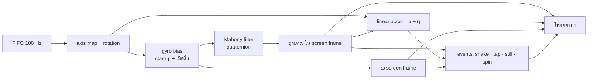

# แผนโหมด 6DOF

ปรับปรุง: 8 ตุลาคม 2026 · เป้าหมาย release v0.2.0

สถานะ v0.1.3: มี FIFO, gyro ±2000°/s, axis map, quaternion fusion, stationary bias, แผงทดสอบแกน และแยกน้ำมีแรงเฉื่อยกับน้ำวนเป็นสองโหมดใหม่ (ID 6/7) แล้ว น้ำปกติยังใช้แรงจากการเอียงและ shake เดิม JS/C++ ตรวจ fusion ต่อเนื่อง 150 samples และแรงน้ำ 50 single-step inputs; ยังไม่รับรอง trajectory ของ solver ที่สะสม 50 steps ภายใน 1e-4 เพราะการชน/เลือก cell อาจต่างกันจาก float กับ double ต้องทำ golden vectors เพิ่มก่อนปิดเกณฑ์ M2 ทั้งหมด ยังไม่มี tap/spin event layer, DeviceMotion หรือโหมด Space/Level/Balance และยังไม่มีผลทดสอบบอร์ดจริง

ข้อความรายละเอียดด้านล่างเป็นแผน v0.2.0 ที่ยังต้องทำให้ครบ เดิม firmware ใช้ accelerometer หา roll/pitch อย่างเดียว ส่วน gyro ใช้แค่ตรวจการเขย่า แผนนี้ใช้ IMU 6 แกนของ BMI160 / MPU6050 เต็มที่ ทั้งแรงโน้มถ่วง แรงที่ขยับตัวเครื่อง ความเร็วการหมุน และทิศทาง 3 มิติ

v0.2.0 ตัด ADXL345 ออกแล้ว เซนเซอร์ทุกตัวที่รองรับมี gyro ทุกโหมดในแผนนี้จึงใช้ gyro ได้โดยไม่ต้องมีทางสำรอง

| งาน | ชนิด | ค่าหลักที่ใช้ |
| --- | --- | --- |
| น้ำมีแรงเฉื่อย | โหมดใหม่ `water-inertia` | แรงเร่งเชิงเส้น (linear acceleration) |
| น้ำวน | โหมดใหม่ `water-swirl` | ความเร็วเชิงมุมรอบแกนจอ ωz และอัตราเปลี่ยน ω̇z |
| น้ำพิกเซล | โหมดใหม่ `pixel-flow` ตาม [แผน Pixel Flow](PIXEL-FLOW-PLAN.md) | gravity + linear acceleration + ωz / ω̇z |
| ตาการ์ตูนตาลาย | อัปเกรดโหมด `pet` | \|ω\|, การเคาะ, ความนิ่ง |
| ลูกเต๋าทอยจริง | อัปเกรดโหมด `dice` | แรงตอนเหวี่ยง, ω, แรงโน้มถ่วง |
| หน้าต่างอวกาศ | โหมดใหม่ `space` | quaternion ทิศทาง 3 มิติ |
| ระดับน้ำ / วัดมุม | โหมดใหม่ `level` | เวกเตอร์แรงโน้มถ่วงที่กรองแล้ว |
| Balance | โหมดใหม่ `balance` | มุมเอียงจาก sensor fusion ที่หน่วงต่ำ |

เป้าหมายรวม 12 โหมดเมื่อเพิ่ม Pixel Flow และ Space/Level/Balance (v0.1.3 มี 8 โหมด; Pixel Flow ยังอยู่ในแผน) ใช้ทั้งบนเครื่อง ในหน้าตั้งค่าบนมือถือ และใน preview บนเว็บ

## 0. ปัญหาที่ต้องแก้ก่อน

### 0.1 การส่งภาพทำให้การอ่าน IMU หยุดชะงัก

`present()` ส่ง framebuffer 240×240×16 bit ผ่าน SPI 20 MHz ใช้เวลาประมาณ **46 ms** ต่อเฟรม (คำนวณจากขนาดข้อมูล ยังไม่ได้วัด) ระหว่างนั้น `loop()` ไม่ได้อ่าน IMU เลย ค่าจึงมาเป็นช่วง ๆ ทุกราว 50 ms แทนที่จะเป็นทุก 10 ms ถ้า integrate gyro จากข้อมูลแบบนี้ มุมจะคลาดเมื่อหมุนเร็ว

**ทางแก้:** อ่านจาก FIFO ของเซนเซอร์ ทั้ง MPU6050 และ BMI160 มี FIFO 1024 byte ซึ่งเก็บ accel+gyro (12 byte ต่อ sample) ได้ประมาณ 85 sample หรือราว 0.85 วินาทีที่ 100 Hz ทุกรอบ loop ให้ดึงข้อมูลทั้งหมดออกมาแล้วป้อน filter ทีละ sample ด้วย dt = 10 ms ที่แน่นอน

ไม่แยกเป็น FreeRTOS task เพราะจอ OLED ใช้ I²C ร่วมกับเซนเซอร์ ถ้าแยก task ต้องมี mutex และจะซับซ้อนกว่า

ทางเสริม: ลองเพิ่ม SPI เป็น 40 MHz บนจอจริง (ส่งภาพประมาณ 23 ms) และเก็บผลไว้ใน `HARDWARE.md`

### 0.2 ช่วง gyro

ปัจจุบันตั้งไว้ ±500°/s (8.7 rad/s) แต่การหมุนพวงกุญแจด้วยมือเกินค่านี้ได้ง่าย ทำให้ค่า saturate และน้ำวนกับตาลายเพี้ยน **จึงเปลี่ยนเป็น ±2000°/s** ความละเอียดยังเหลือ 16.4 LSB/°/s ซึ่งพอสำหรับทุกโหมด ต้องแก้ค่าที่เขียนลง register และ scale ใน `motion_sensor.h` รวมถึง test

### 0.3 ทิศแกนของโมดูล

BMI160 กับ GY-521 วางแกน X/Y/Z บนแผ่นวงจรไม่เหมือนกัน และแต่ละคนอาจติดเซนเซอร์ในเคสคนละทิศ ต้องมี **axis map** (สลับแกนและกลับเครื่องหมาย) ที่ตั้งได้จากมือถือและเก็บใน NVS เพื่อแปลงทุก sample เข้าสู่ **screen frame** ก่อนใช้งาน:

- x ชี้ไปทางขวาของจอ
- y ชี้ลงล่างของจอ
- z ชี้เข้าไปในจอ ห่างจากผู้ใช้ (ระบบมือขวา)

จากนั้นค่อยหมุนตาม `rotation` ที่ตั้งไว้ ปัจจุบันโค้ดหมุนแค่ accel X/Y ของใหม่ต้องหมุนทั้ง accel และ gyro

## 1. Motion layer กลาง (M1)

ไฟล์ใหม่ `firmware/tilt_toy/motion_state.h` และไฟล์คู่กันฝั่งเว็บ `web/motion.js` ใช้สมการและค่าคงที่ชุดเดียวกัน แบบเดียวกับ `flip_fluid.h` / `fluid.js`

| ค่าที่ส่งออก | หน่วย | ใช้ใน |
| --- | --- | --- |
| `q` quaternion | – | หน้าต่างอวกาศ |
| `gravity` (x, y, z) unit vector | – | ทุกโหมด (แทน atan2 เดิม), ระดับน้ำ |
| `roll`, `pitch` | องศา | ใช้นิยามเดิมเพื่อให้โหมดเดิมไม่เปลี่ยนพฤติกรรม |
| `linear` (x, y, z) | m/s² | น้ำมีแรงเฉื่อย, ลูกเต๋า, ตกใจ |
| `linearFrame` | m/s² | ค่าเฉลี่ยตลอดช่วงเฟรม ไว้ป้อน solver แรงกระชากสั้นจะได้ไม่หายไประหว่างเฟรม |
| `omega` (x, y, z) | rad/s | น้ำวน, ตาลาย, ลูกเต๋า |
| `omegaDot` z | rad/s² | น้ำวน (แรง Euler) |
| `yaw` | องศา (สัมพัทธ์) | หน้าต่างอวกาศ (ลอยช้า ๆ เพราะไม่มีเข็มทิศ) |
| `stillMs` | ms | ตาง่วง, อัปเดต bias, ล็อกค่าระดับน้ำ |
| events | – | `shake`, `tap`, `spinStart` |

**รายละเอียด**

- **Mahony filter:** Kp ≈ 1.0, Ki ≈ 0.01 ใช้ accel แก้มุมเฉพาะเมื่อ \|‖a‖ − g\| < 2 m/s² เพื่อไม่ให้การเขย่าดึงทิศเพี้ยน ใช้ประมาณ 150 flop ต่อ sample ซึ่งน้อยมากแม้เป็น soft-float บน C6
- **Gyro bias:** คาลิเบรตตอนเปิดเครื่องเหมือนเดิม แล้วปรับต่อแบบ EMA เมื่อนิ่งเกิน 1 วินาที (‖ω‖ < 0.05 rad/s และ \|‖a‖ − g\| < 0.3)
- **Shake:** ย้ายเงื่อนไขเดิมจาก `readImu()` มาไว้ที่นี่ ผลลัพธ์ต้องเหมือนเดิม
- **Tap:** linear accel พุ่งเกิน 15 m/s² ไม่เกิน 60 ms และต้องไม่ใช่ส่วนหนึ่งของการเขย่า

**หน้าตั้งค่าบนมือถือ:** เพิ่มแผง "ทดสอบแกน" แสดงลูกศร gravity, แถบ ω และแถบ linear accel แบบสด พร้อมขั้นตอนตรวจ:

1. วางเครื่องบนโต๊ะ แล้วหมุนตามเข็มนาฬิกา (มองจากหน้าจอ) ωz ต้องเป็นบวก
2. กระตุกเครื่องไปทางขวา linear x ต้องเป็นบวก
3. ถ้าค่าไม่ตรง ให้กดสลับหรือกลับแกน แล้วบันทึกเป็น axis map

**`/api/status`:** เพิ่ม `gravity`, `omega`, `linear`, `yaw` และค่าของแต่ละโหมด ขยาย buffer JSON จาก 512 เป็น 1024

**Preview บนเว็บ:**

- เพิ่มแถบเลื่อน "หมุนรอบจอ" (ωz ±720°/s) และปุ่มกระตุกซ้าย/ขวา/ขึ้น
- ป้อนค่าเหล่านี้เข้า `web/motion.js` ตัวเดียวกับที่ใช้จำลองเครื่อง
- บนโทรศัพท์ ถ้าผู้ใช้อนุญาต ให้ใช้ `DeviceMotionEvent` / `DeviceOrientationEvent` แทนแถบเลื่อน (iOS ต้องกดขออนุญาต และ GitHub Pages เป็น HTTPS อยู่แล้ว)

## 2. น้ำมีแรงเฉื่อย (M2)

ในกรอบอ้างอิงของภาชนะ น้ำรู้สึกแรง `a_eff = g − a_container` ถ้ากระตุกเครื่องไปทางขวา น้ำจะถูกผลักไปซ้ายแล้วซัดกลับ

- หน่วยของ solver: ภาชนะกว้าง 1 หน่วย และปัจจุบันใช้ gravity = 4 หน่วย/s² แทน 9.81 m/s² จึงแปลงด้วย `k = 4 / 9.81`
- ค่าที่ป้อนเข้า solver: `(gx, gy) = k · sensitivity · (9.81 · gravity.xy − linearFrame.xy)`
  - `gravity.xy` แทน `sin(roll)·cos(pitch)` ของเดิม (ค่าเดียวกันแต่ไม่มีเอกฐานที่ pitch ±90°)
  - deadband 0.4 m/s² เพื่อไม่ให้น้ำสั่นตอนวางนิ่ง
  - จำกัดขนาดไม่เกิน 3 เท่าของ g เพื่อให้ solver เสถียร
- `shake()` ในโหมดน้ำลดเหลือ impulse เบา ๆ เพราะแรงเฉื่อยทำให้น้ำกระเซ็นเองแล้ว
- **เกณฑ์ผ่าน:**
  - วางนิ่ง 10 วินาที ผิวน้ำต้องนิ่ง (จุดศูนย์กลางมวลของอนุภาคเลื่อนน้อยกว่า 1 px)
  - กระตุกไปขวา จุดศูนย์กลางมวลต้องเลื่อนไปซ้ายก่อนแล้วค่อยแกว่งกลับ ตรวจทั้งใน Node test และบนเครื่องจริง

## 3. น้ำวน (M2)

เมื่อเครื่องหมุนรอบแกนจอด้วย ω (screen frame และ y ชี้ลง) น้ำในกรอบของจอจะได้แรงเสมือนต่อหน่วยมวลที่ตำแหน่ง r เทียบกับศูนย์กลางภาชนะ ความเร็ว v:

| แรง | สูตร 2D | ผลที่เห็น |
| --- | --- | --- |
| Euler | `−ω̇ × r` | เริ่มหมุนแล้วน้ำค้าง ดูเหมือนหมุนสวนทาง |
| Coriolis | `−2ω × v` | น้ำที่กำลังไหลเลี้ยวเป็นวง |
| Centrifugal | `ω² r` | หมุนเร็วแล้วน้ำเหวี่ยงออกขอบ ตรงกลางบุ๋ม |

ผนังใน solver ตอนนี้ไม่มีแรงเสียดทาน ซึ่งถูกตามฟิสิกส์ (น้ำในแก้วผิวลื่นไม่หมุนตามแก้ว) แต่จะไม่เกิด "น้ำวนต่อหลังหยุดหมุน" จึงเพิ่ม `wallDrag` (ค่าเริ่มต้น 0.15) ลดความเร็วสัมพัทธ์ของอนุภาคที่อยู่ภายใน 1 cell จากผนัง ให้เข้าใกล้ศูนย์ (ผนังอยู่นิ่งใน screen frame) ผลคือน้ำค่อย ๆ หมุนตาม และยังวนต่อสักพักหลังหยุด

**การเปลี่ยน solver:**

- เปลี่ยน signature เป็น `advance(dt, ax, ay, omega, omegaDot)` ทั้งใน `flip_fluid.h` และ `fluid.js`
- ใช้ ω ที่กรอง low-pass ประมาณ 10 Hz ส่วน ω̇ มาจากค่าที่กรองแล้ว และจำกัดไม่เกิน 40 rad/s²
- เพิ่มงานประมาณ 12 flop ต่อ particle ต่อ substep เทียบกับ `separate()` ถือว่าน้อย
- ระบายสีตามความเร็ว (ช้าเป็นน้ำเงินเข้ม เร็วเป็นฟ้าขาว) ให้เห็นการวน

**กรณีถือเครื่องตั้ง:** การหมุนรอบแกนจอก็คือการเปลี่ยน roll gravity จึงจัดการส่วนใหญ่อยู่แล้ว แรงเสมือนเพิ่มแค่ความเฉื่อย กรณีวางราบบนฝ่ามือแล้วหมุนจะเห็นน้ำวนชัดที่สุด

**เกณฑ์ผ่าน:**

- วางราบแล้วป้อน ω = +3 rad/s คงที่ 2 วินาที angular momentum ของน้ำใน screen frame ต้องมีเครื่องหมายตรงข้ามกับ ω ก่อน แล้วค่อยลดลงตามผลของ `wallDrag`
- หยุดหมุนแล้วน้ำยังวนต่อ 1–3 วินาที

**Parity:** สร้าง golden vectors ไว้ที่ `tests/motion/fluid-vectors.json` (สภาพเริ่มต้นและ input 50 step) แล้วตรวจว่า JS กับ C++ ได้ตำแหน่งอนุภาคตรงกันภายใน 1e-4 ฝั่ง C++ รันใน CI บน Ubuntu ที่มี g++

## 4. ตาการ์ตูนตาลาย (M4)

ใช้ state machine ตามตาราง:

| สถานะ | เข้าเมื่อ | ภาพ | ออกเมื่อ |
| --- | --- | --- | --- |
| ปกติ | ค่าเริ่มต้น | ตาดำมองตามทิศเอียง และมีแรงเฉื่อยแบบสปริงจาก linear accel | – |
| ตาลาย | `dizzy > 4π` (หมุนเร็วประมาณ 2 รอบ) | ตาดำเป็นก้นหอยหมุนสวนทิศ ตาโยกเยก | dizzy ลดต่ำกว่า π |
| ตกใจ | tap หรือกระชากแรง | ตาโตขึ้น ตาดำเล็กลง | 600 ms |
| ง่วง | นิ่งเกิน 20 วินาที | เปลือกตาลดลงช้า ๆ | ขยับ |
| หลับ | นิ่งเกิน 60 วินาที | ตาปิดเป็นเส้นโค้ง | ขยับ (ลืมตาแบบงัวเงีย) |

- **ตัวนับ dizzy:** `dizzy += ‖ω‖·dt` และ `dizzy −= 1.5·dt` (ไม่ต่ำกว่า 0) ช่วงเวลาที่ตาลายจึงแปรตามความแรงของการหมุน
- **จอ OLED สีเดียว:** วาดก้นหอยเป็นเส้น ส่วนเปลือกตาใช้ `fillRect` สีดำทับ
- **Preview:** ใช้แถบเลื่อน "หมุนรอบจอ" และปุ่มกระตุก บนคอมพิวเตอร์มีปุ่มข้าม 20 วินาทีไว้ทดสอบสถานะง่วง

## 5. ลูกเต๋าทอยจริง (M3)

มองจากด้านบนเป็นลูกเต๋า 2D ที่กลิ้งในพื้นที่จอ

1. **ทอย:** เมื่อ linear accel พุ่งเกิน 12 m/s² หรือเกิด shake ความเร็วต้นของลูกเต๋า = `−linear` สูงสุดในหน้าต่าง 150 ms (ลูกเต๋าวิ่งสวนทางกับการกระชาก) และความเร็วหมุนมาจาก ωz
2. **ระหว่างกลิ้ง:**
   - ลูกเต๋าไถลตามแรงโน้มถ่วงในระนาบจอ มีแรงเสียดทานลดความเร็ว
   - ชนขอบจอแล้วเด้ง (สัมประสิทธิ์ 0.5) ส่วนจอกลมเด้งกับขอบวงกลม
   - ทุกครั้งที่เคลื่อนที่ได้ 1 เท่าของขนาดลูกเต๋า นับเป็นการพลิก 1 ครั้ง หน้าใหม่สุ่มจาก 4 หน้าที่อยู่ติดหน้าเดิม (ไม่ใช่หน้าตรงข้าม) โดยใช้ `esp_random()` ทั้งหมดนี้เป็นรายละเอียดภาพ ไม่ใช่การจำลองลูกบาศก์ 3D
   - ทุกการทอยพลิกอย่างน้อย 4 ครั้ง ทอยแรงก็พลิกมากขึ้น
3. **หยุด:** ความเร็วต่ำกว่าเกณฑ์ หน้าสุดท้ายคือผล และขอบลูกเต๋ากระพริบหนึ่งครั้ง

**ความยุติธรรม:** การสุ่มหน้าติดกันบนลูกบาศก์เป็น Markov chain บนกราฟ octahedron ซึ่ง aperiodic จึงลู่เข้าการกระจายสม่ำเสมอ ทดสอบด้วยการจำลอง 60,000 ทอยใน Node แล้วต้องผ่าน chi-square ที่ p > 0.01 ถ้าพลิกน้อยกว่า 4 ครั้งยังเอนเอียง จึงบังคับขั้นต่ำไว้

ตั้งจำนวนลูกเต๋าได้ 1–2 ลูกจากมือถือ และหน้ามือถือแสดงผลล่าสุดพร้อมประวัติ 10 ครั้ง

## 6. หน้าต่างอวกาศ (M7)

จอทำหน้าที่เหมือนหน้าต่างมองท้องฟ้าจำลอง 360° ทิศที่มองคือแกน +z ของจอ (มองทะลุจอออกไป) ตามทิศทางจาก quaternion

- **ฉาก:**
  - ดาว 300 ดวงสร้างจาก seed คงที่ เก็บเป็น unit vector แบบ `int8` ใช้ประมาณ 900 byte ใน flash
  - ความสว่าง 3 ระดับ และกระพริบเล็กน้อย
  - มีแถบทางช้างเผือกจาง ๆ ดวงจันทร์ 1 ดวง ดาวเคราะห์มีวงแหวน 1 ดวง และกลุ่มดาวที่ลากเส้นแล้ว 3 กลุ่ม
- **กล้อง:** FOV 60° ต่อด้านสั้นของจอ ฉายแบบ perspective ตัดดาวที่อยู่หลังกล้องทิ้ง ใช้ประมาณ 300 × (9 mul + 1 div) ต่อเฟรม ซึ่งเล็กเมื่อเทียบกับเวลาส่งภาพ
- **ไม่มีเกม:** โหมดนี้เป็นฉากให้มองเล่นอย่างเดียว ไม่มีเป้าหมายและไม่มีคะแนน
- **Yaw drift:** ไม่มีเข็มทิศ yaw จึงลอยช้า ๆ ซึ่งไม่เป็นปัญหาสำหรับการมองเล่น เขย่า 1 ครั้งเพื่อ recenter ให้ทิศปัจจุบันเป็น "ทิศเหนือ" ของฉาก
- **Preview:** ลากบนจอเพื่อมองรอบ ๆ และบนโทรศัพท์ใช้ `DeviceOrientationEvent`
- **จอ OLED:** แสดงแค่จุดดาวและเส้นกลุ่มดาว

## 7. ระดับน้ำ / วัดมุม (M5)

เลือกมุมมองอัตโนมัติตามทิศของแรงโน้มถ่วง:

| ท่าเครื่อง | ภาพบนจอ | ตัวเลขบนมือถือ |
| --- | --- | --- |
| วางราบ (\|gravity.z\| > 0.8) | ฟองอากาศลอยสวนทางกับทิศเอียง บนวงแหวนที่มีขีดบอกมุมทุก 1° และ 5° | มุมเอียงจากแนวราบ และทิศที่เอียง |
| ตั้งขึ้น | เส้นระดับน้ำแนวนอนหมุนตามมุม มีขีดบอกมุมรอบขอบ | roll (มุมเทียบแนวดิ่ง) |

- **ไม่มีตัวเลขบนจอ:** อ่านมุมบนจอได้จากตำแหน่งฟองอากาศหรือเส้นเทียบกับขีด ส่วนตัวเลขละเอียด 0.1° ดูบนหน้ามือถือ (`levelAngle`, `levelAxis`, `levelLocked` ใน `/api/status`)
- **ใกล้ 0° หรือ 90°:** เมื่อห่างไม่เกิน 0.3° ฟองหรือเส้นเปลี่ยนเป็นสีเขียว บนจอ OLED ใช้ฟองแบบทึบแทนสี
- **ความแม่น:**
  - คำนวณจาก gravity ที่เฉลี่ยประมาณ 0.5 วินาทีขณะนิ่ง และใช้ gyro ทำให้ภาพลื่นระหว่างขยับ
  - **คาลิเบรต 2 ท่า** จากหน้ามือถือ: วางราบหนึ่งครั้ง หมุน 180° บนพื้นเดิมอีกครั้ง แล้วเฉลี่ยเพื่อตัด offset ของเซนเซอร์และของพื้นผิว เก็บผลใน NVS
  - เป้าหมาย ±0.3° หลังคาลิเบรต และต้องวัดเทียบกับระดับน้ำจริงก่อนอ้างตัวเลขนี้
- **ล็อกค่า:** นิ่ง 2 วินาทีแล้วค่าบนมือถือค้าง และบนจอมีจุดเล็ก ๆ บอกสถานะ ยกเครื่องขึ้นแล้วค่ายังค้างไว้ให้อ่าน 5 วินาที

## 8. Balance (M6)

ประคองลูกบอลให้อยู่ในวงเป้าหมายบนจานที่เอียงตามมือ

- **ฟิสิกส์:** ลูกบอลกลิ้งบนจาน `a = (5/7)·g·sin θ` ทั้งแกน x และ y มีแรงเสียดทานกลิ้งเล็กน้อย θ มาจาก gravity ที่ผ่าน Mahony ซึ่งหน่วงน้อยกว่า EMA 0.16 ของเดิมที่หน่วงประมาณ 60 ms ทำให้ตอบสนองไวพอจะประคองได้
- **ความยาก:** ทุก 10 วินาทีวงเป้าหมายเล็กลง เริ่มลอยไปมาช้า ๆ และมีลมกระโชกสุ่ม (แรงผลักสั้น ๆ พร้อมเส้นลมเตือนล่วงหน้า 0.5 วินาที)
- **จบเกม:** ลูกบอลตกขอบจาน
- **คะแนน:** วินาทีที่อยู่ในวง บนจอแสดงเป็นวงแหวนความคืบหน้ารอบขอบ ไม่ใช่ตัวเลข ส่วนมือถือแสดงเวลาปัจจุบันและสถิติ สถิติสูงสุดเก็บใน NVS
- **จอสี่เหลี่ยม:** ใช้จานวงกลมเต็มด้านสั้น **จอ 80×160:** ใช้ราง 1D ตามแกนยาว และใช้แค่ roll

## 9. สิ่งที่ใช้ร่วมกัน

- **ลำดับ ID/NVS ตามแผน:** `water, maze, snow, pong, pet, dice, water-inertia, water-swirl, pixel-flow, space, level, balance`
  - ไม่เปลี่ยน ID 0–7 ที่มีแล้ว; Pixel Flow ใช้ 8 และโหมดอนาคต Space/Level/Balance ใช้ 9/10/11
  - แก้ `modeIds`, `ModeCount`, ตัวนับรอบของปุ่ม, `<select>` บนมือถือ และ `modes` ใน `web/profiles.js`; ใช้ `ModeCount-1` แทนขอบเขตเลขคงที่
- **เลือกโหมดในรอบปุ่ม:** เมื่อมีครบ 12 โหมดแล้วกดวนจะนานขึ้น จึงเพิ่มรายการ checkbox บนมือถือให้เลือกได้ว่าโหมดไหนอยู่ในรอบการกดปุ่ม เก็บเป็น bitmask ใน NVS ค่าเริ่มต้นเปิดทุกโหมดที่ติดตั้ง และต้องเปิดไว้อย่างน้อย 1 โหมด
- **กฎหน้าจอ:** จอไม่มีข้อความหรือตัวเลข ยกเว้นตอนเปิด Wi-Fi และเมื่อไม่พบ IMU ค่าทั้งหมดไปแสดงบนมือถือ
- **NVS keys ใหม่:** `axisMap`, `levelCal`, `balanceBest`, `diceCount`, `modeMask`
- **งบเวลา:** คำนวณของแต่ละโหมดไม่เกิน 20 ms ต่อเฟรมบน C6 และแสดง `frameMs` ในหน้ามือถือเหมือน `simMs` ตัวเลขนี้เป็นเป้าหมาย ต้องวัดบนเครื่องจริง
- **เวอร์ชัน:** `TOY_VERSION` และ `package.json` เปลี่ยนเป็น 0.2.0 แล้ว build firmware ใหม่ทั้ง 18 คู่บอร์ด/จอ

## 10. ลำดับงานและเกณฑ์ผ่าน

| ขั้น | งาน | เกณฑ์ผ่านซอฟต์แวร์ | เกณฑ์ผ่านบนเครื่องจริง |
| --- | --- | --- | --- |
| M0 | ตัด ADXL345 ✔ | test ผ่าน, ไม่เหลือการอ้างถึงใน source/docs | – |
| M1 | FIFO, gyro ±2000°/s, axis map, Mahony, events, แผงทดสอบแกน, input ของ preview | Node test: มุมนิ่ง ±0.5°, ωz คงที่ทำให้ yaw เพิ่มเชิงเส้น, linear ≈ 0 ขณะนิ่ง, shake/tap ไม่ชนกัน; C++ parity ใน CI | ตรวจเครื่องหมายแกนทั้ง BMI160 และ MPU6050; yaw ลอยไม่เกิน 10° ต่อนาทีขณะนิ่ง |
| M2 | น้ำมีแรงเฉื่อย + น้ำวน | test ทิศของการซัดและการวน, golden vectors JS = C++ | `simMs` อยู่ในงบ, น้ำนิ่งเมื่อวาง, หมุนบนฝ่ามือแล้วเห็นน้ำวน |
| M3 | ลูกเต๋าทอยจริง | chi-square 60k ทอย p > 0.01, พลิกอย่างน้อย 4 ครั้ง | เหวี่ยงแรงต่างกันแล้วกลิ้งยาวต่างกัน |
| M4 | ตาการ์ตูนตาลาย | test state machine ด้วยลำดับ input จำลอง | หมุน 2 รอบแล้วตาลาย, วางนิ่ง 20 วินาทีแล้วง่วง |
| M5 | ระดับน้ำ / วัดมุม | test มุมจาก gravity สังเคราะห์, ตรรกะคาลิเบรต 2 ท่า | ห่างจากระดับน้ำจริงไม่เกิน ±0.3° หลังคาลิเบรต |
| M6 | Balance | test ฟิสิกส์ลูกบอลและการจบเกม | ประคองได้นานกว่า 30 วินาทีในระดับแรก |
| M7 | หน้าต่างอวกาศ | test การฉายภาพ: ดาวที่อยู่หลังกล้องไม่ถูกวาด, recenter | หมุนครบรอบแล้วฉากกลับมาตรงทิศเดิม (คลาดไม่เกิน 15°) |
| M8 | DeviceMotion ใน preview, docs, v0.2.0 | test ผ่าน, build ครบ, browser QA บนมือถือ | เติม checklist ใน `VALIDATION.md` |

เหตุผลของลำดับ: M1 เป็นฐานของทุกงาน M2 ได้ผลชัดที่สุดและใช้ solver เดิม M7 ทำท้ายสุดเพราะต้องพึ่งความแม่นของ quaternion มากที่สุด

## 11. ไฟล์ที่จะเปลี่ยน

| ไฟล์ | การเปลี่ยนแปลง |
| --- | --- |
| `firmware/tilt_toy/motion_sensor.h` | อ่าน FIFO, ตั้ง gyro ±2000°/s |
| `firmware/tilt_toy/motion_state.h` (ใหม่) | Mahony, bias, linear accel, events, axis map |
| `firmware/tilt_toy/flip_fluid.h` | แรงเสมือน, `wallDrag`, signature ใหม่ |
| `firmware/tilt_toy/modes/*.h` (ใหม่) | แยก dice, pet, space, level, balance ออกจาก `renderGame()` ที่ยาวขึ้นเรื่อย ๆ |
| `firmware/tilt_toy/tilt_toy.ino` | ลำดับโหมด, API, NVS, หน้ามือถือ (แผงทดสอบแกนและค่าของแต่ละโหมด) |
| `scripts/build-firmware.mjs` | stage ไฟล์ใหม่ทั้งหมด และรวมใน `sourceSha256` |
| `web/motion.js` (ใหม่) | mirror ของ `motion_state.h` |
| `web/fluid.js`, `web/preview.js` | mirror ของ solver และ 3 โหมดใหม่ |
| `web/app.js`, `web/index.html`, `web/style.css` | แถบหมุน, ปุ่มกระตุก, ลากเพื่อมอง, DeviceMotion |
| `web/profiles.js` | รายชื่อ 9 โหมด |
| `tests/motion-state.test.mjs`, `tests/modes.test.mjs` (ใหม่) | test ตามตารางข้อ 10 |
| `tests/motion/*.cpp` | parity และ FIFO |
| `README.md`, `docs/*.md` | โหมดใหม่, การตรวจแกน, ผลวัด |

## 12. ข้อตัดสินใจ (ปรับปรุง 8 ตุลาคม 2026)

1. **โหมดระดับน้ำไม่แสดงตัวเลขบนจอ:** บนจอใช้ฟอง เส้น และขีดบอกมุม ส่วนตัวเลขดูบนมือถือ
2. **ใช้ gyro ±2000°/s:** เพื่อไม่ให้ค่า saturate เมื่อหมุนพวงกุญแจเร็ว ความละเอียดที่เหลือยังพอสำหรับทุกโหมด
3. **รอบปุ่มเปิดทุกโหมดที่ติดตั้งเป็นค่าเริ่มต้น:** เป้าหมาย 12 โหมดเมื่อรวม Pixel Flow ผู้ใช้ปิดบางโหมดได้จากมือถือเมื่อเพิ่มระบบ modeMask
4. **หน้าต่างอวกาศไม่มีเกม:** เป็นฉากให้มองเล่นอย่างเดียว
