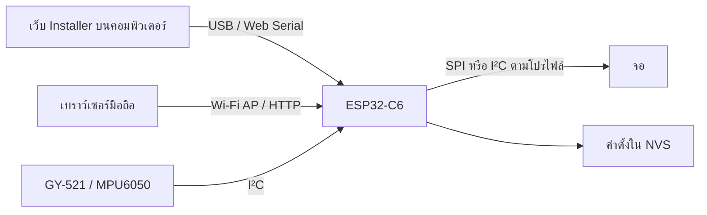

# แผนพัฒนา esp32-tilt-toy

ปรับปรุง: 7 ตุลาคม 2026

เป้าหมายคือพวงกุญแจ ESP32-C6 SuperMini + GY-521/MPU6050 ที่เล่นด้วยการเอียงและเขย่า มีหลายโหมดในเฟิร์มแวร์เดียว เลือกจอก่อนแฟลชผ่านเว็บ และเปลี่ยนโหมดจากมือถือผ่าน Wi-Fi ของเครื่องได้

เอกสารนี้ระบุงานและเกณฑ์ผ่าน การ build ผ่านไม่ใช่การยืนยันว่าจอจริงหรือแบตเตอรี่ผ่านการทดสอบแล้ว ให้บันทึกผลทดลองจริงแยกตามรุ่นบอร์ดและโมดูลจอ

รุ่นแรกมีเว็บ installer + preview, firmware หกโหมด และหน้า device UI แล้ว ขั้นต่อไปคือทดสอบกับ C6 และจอจริงตามระยะ D ก่อนออกแบบแบตเตอรี่/เคสตามระยะ E ช่องที่ทำเครื่องหมายระบุผลตรวจซอฟต์แวร์เท่านั้น

## 1. ขอบเขตจอและเฟิร์มแวร์

| โปรไฟล์ | จอเป้าหมาย | ชิป/การต่อ | การวาดภาพ |
| --- | --- | --- | --- |
| TFT 80×160 | จอสี่เหลี่ยมแนวตั้งขนาดเล็ก | ST7735/ST7735S, SPI | RGB565; ปรับเป็นแนวนอนได้ |
| GMT130 240×240 | GMT130-V1.0 1.3 นิ้ว | ST7789, SPI, 7 ขา ไม่มี CS บน header | RGB565 สี่เหลี่ยม |
| TFT 240×240 | จอสี่เหลี่ยมทั่วไปที่ใช้ ST7789 | ST7789, SPI, มี CS | RGB565 สี่เหลี่ยม |
| Round TFT 240×240 | ตัวเลือกเพิ่มเติมสำหรับจอกลม | GC9A01/GC9A01A, SPI | RGB565 พร้อมพื้นที่เล่นวงกลม |
| OLED 128×64 | OLED 0.96 นิ้ว 4 ขา | SSD1306, I²C | สีเดียว 1 บิตต่อพิกเซล |

ชื่อขนาดจออย่างเดียวไม่ระบุชิป ต้องตรวจตัวโมดูลและเลือกโปรไฟล์ให้ตรง SH1106 ไม่ใช้ไดรเวอร์ SSD1306 โดยอัตโนมัติ ส่วนจอ TFT 240×240 แบบกลมกับแบบสี่เหลี่ยมต้องแยกโปรไฟล์ รายละเอียดการต่อและข้อจำกัดอยู่ใน [HARDWARE.md](HARDWARE.md)

**แนวทาง release:** build หนึ่ง merged binary ต่อโปรไฟล์ รวมทุกโหมดที่รองรับใน binary นั้น เว็บเลือกโปรไฟล์แล้วโหลด manifest ของโปรไฟล์เดียว หลีกเลี่ยง manifest ที่มีหลาย build ของ ESP32-C6 แต่ต่างจอ เพราะระบบตรวจ chip ตรวจได้แค่ตระกูล ESP32 ไม่ทราบรุ่นจอ

## 2. โครงสร้างระบบ

| ส่วน | ความรับผิดชอบ |
| --- | --- |
| Display profile | ขนาด รูปทรง ไดรเวอร์ GPIO การหมุน สี inversion และค่าเริ่มต้นเฉพาะโมดูล |
| Display abstraction | API วาดจุด เส้น รูปทรง ข้อความ ล้างภาพ และส่งภาพ; คืนค่า width/height/monochrome/round |
| Motion input | อ่าน MPU6050 ตรวจ sensor disconnect คาลิเบรต bias กรองมุมและแรงเร่ง ตรวจ shake |
| Game engine | จัดเวลา update แยกจาก render มีสถานะของโหมดที่กำลังเล่นเท่านั้น |
| Settings | รุ่นแรกบันทึกโหมด ความไว ระดับน้ำ rotation inversion และ SPI mode; brightness และ calibration ที่บันทึกข้ามการบูตเป็นงานต่อยอด |
| Device web UI | เลือกโหมดและตั้งค่าบนมือถือเมื่อเชื่อม AP ของอุปกรณ์ |
| Desktop installer | เลือกโปรไฟล์ ดูสายต่อ เปิด Web Serial แฟลชจริง แสดง progress/error/download |
| Build/release tools | compile ทุกโปรไฟล์ merge binary สร้าง manifest/checksum/version metadata และตรวจไฟล์ |

แยกพิกัดเชิงตรรกะของเกมจาก pixel จอ ใช้ขนาดพื้นที่เล่นที่อิง width/height และ margin จอกลมต้องวางคะแนนและปุ่มแสดงสถานะในพื้นที่มองเห็น ส่วน OLED ใช้ outline/dither แทนการอาศัยสีเพื่อสื่อสถานะ

เฟรม RGB565 240×240 มีข้อมูล 115,200 ไบต์ (112.5 KiB), 80×160 มี 25,600 ไบต์ และ OLED 128×64 แบบ 1 บิตมี 1,024 ไบต์ เป็นการคำนวณจากจำนวนพิกเซล ESP32-C6 มี HP SRAM 512 KB ซึ่งเฟิร์มแวร์ ระบบเครือข่าย และ stack ใช้ร่วมกัน จึงเริ่มด้วย buffer เดียวหรือวาดเป็นแถบ และวัด free heap/minimum heap ระหว่างเปิด Wi-Fi [ข้อมูลหน่วยความจำ Espressif](https://documentation.espressif.com/esp32-c6_datasheet_en.html)

## 3. หกโหมดที่ใช้ทรัพยากรจำกัด

| โหมด | พฤติกรรม | วิธีลดภาระ |
| --- | --- | --- |
| Liquid | น้ำไหลตามแรงโน้มถ่วง กระเซ็นเมื่อ shake | FLIP/PIC ขนาดเล็ก (สูงสุด 400 cells / 900 particles) แบบ fixed step 25 ms; วัด `simMs` บน C6 แล้วลดกริด/particle หากเกินงบเฟรม |
| Maze | เอียงให้ลูกบอลไปถึงเป้าหมาย | รุ่นแรกใช้กำแพง 2 แผงและวงกลม collision; เพิ่มแผนที่ช่องภายหลัง |
| Snow globe | เขย่าให้หิมะฟุ้งและตกตามทิศถือ | จำกัดจำนวน particle ต่อโปรไฟล์และ reuse array |
| Pong | เอียงเพื่อรับลูกบอล | รุ่นแรกใช้สนามวงกลมที่ย่อให้พอดีทุกจอ; ต่อไปปรับสนามตาม aspect ratio |
| Pet / Eyes | ตากลอกตามการเอียงและกะพริบ | รูปทรง vector; พฤติกรรมตกใจ/หลับเมื่อวางนิ่งเป็นงานต่อยอด |
| Dice / Random | เขย่าเพื่อสุ่มแล้วแสดงผล | animation สั้น; cooldown ป้องกันสุ่มซ้ำจาก shake เดียว |

เป้าหมายเริ่มต้นคือ sensor ประมาณ 100 Hz และภาพ 20–30 FPS ตามโปรไฟล์ เป็นเป้าหมายที่ต้องวัดจริง ลดจำนวน particle หรืออัตราภาพเมื่อเวลา render เกินงบ จอ OLED กับ sensor แชร์ I²C จึงต้องเผื่อเวลาส่ง buffer ของ OLED ไม่ให้การอ่านเซนเซอร์หยุดนาน

MPU6050 ใช้ accelerometer และ gyro สำหรับ roll/pitch การอ่าน gyro หน่วย rad/s ต้องแปลงให้ตรงกับหน่วยที่ใช้ในตัวกรอง หยุดนิ่งก่อนคาลิเบรต และไม่อ้างว่าได้ yaw แบบเข็มทิศจากเซนเซอร์ 6 แกน [ตัวอย่างและไลบรารี MPU6050](https://learn.adafruit.com/mpu6050-6-dof-accelerometer-and-gyro/arduino)

## 4. แฟลชผ่านเว็บบนคอมพิวเตอร์

ใช้ Web Serial ผ่าน ESP Web Tools หรือ esptool-js พร้อม version ที่ตรึงไว้ใน dependencies รองรับเส้นทางหลักเป็น Chrome/Edge บน desktop ตัว API ขอสิทธิ์เลือกพอร์ตจากการกดของผู้ใช้ และต้องใช้ secure context เช่น HTTPS หรือ localhost [Chrome Web Serial](https://developer.chrome.com/docs/capabilities/serial), [esptool-js ของ Espressif](https://github.com/espressif/esptool-js)

ลำดับการใช้งาน:

1. เลือก ESP32-C6 และโปรไฟล์จอ พร้อมแสดง controller และผังขาของโปรไฟล์นั้น
2. ตรวจว่ามี binary/version/checksum ของโปรไฟล์และไฟล์โหลดได้ก่อนเปิดปุ่มแฟลช
3. ต่อ USB ที่ส่งข้อมูลได้และกดเชื่อมต่อ เลือกพอร์ตที่แสดงใน browser
4. ตรวจ chipFamily เป็น ESP32-C6; หยุดเมื่อชิปไม่ตรง
5. แสดงสิ่งที่จะถูกเขียนและผลต่อการตั้งค่าที่บันทึกไว้ ก่อนเริ่มเขียน flash
6. โหลด merged binary แสดง progress และสถานะ verify/reset ตามผลจริงของ flasher
7. เมื่อเสร็จ แสดงวิธีเปิด Wi-Fi ตั้งค่าและปุ่มดาวน์โหลด binary เป็นทางเลือก

manifest ใช้ `chipFamily: "ESP32-C6"` และ merged binary ที่ offset `0` ตรึงไฟล์เป็น version เดียวกันทั้ง manifest และ binary ให้ relative URL ถูกต้อง ถ้าแยก host ต้องตั้ง CORS ของไฟล์ [รูปแบบ ESP Web Tools](https://esphome.github.io/esp-web-tools/)

รองรับข้อผิดพลาดจริง: ยกเลิกเลือกพอร์ต, พอร์ตถูกโปรแกรมอื่นใช้อยู่, หลุดระหว่างแฟลช, เข้า bootloader ไม่สำเร็จ, chip ไม่ตรง, binary หาย และ HTTP response ไม่ใช่ binary ห้ามใช้ progress จำลองแทนผลแฟลชจริง หากไม่มีฮาร์ดแวร์ ต้องระบุว่า serial flash ยังไม่ได้ทดลองกับบอร์ด

## 5. ตั้งค่าจากมือถือ

เฟิร์มแวร์เปิด access point เมื่อกดปุ่มค้าง ให้ผู้ใช้ต่อ Wi-Fi แล้วเปิด `http://192.168.4.1` เมื่อกำหนด IP นี้จริงใน firmware หน้า UI และ API ให้บริการจาก ESP32 โดยตรง จึงใช้งานได้โดยไม่ต้องมีอินเทอร์เน็ต [Arduino ESP32 Wi-Fi AP](https://docs.espressif.com/projects/arduino-esp32/en/latest/api/wifi.html)

หน้า device UI แสดงโหมดปัจจุบัน เปลี่ยนโหมด/ความไว/ระดับน้ำ/rotation และค่า inversion/SPI ตามชนิดจอ พร้อมคาลิเบรต gyro บันทึกค่าเมื่อผู้ใช้กดบันทึกแทนการเขียน flash ทุก sensor sample ใช้ NVS/Preferences สำหรับค่าขนาดเล็กและโหลดโหมดล่าสุดเมื่อบูต [Preferences ของ Espressif](https://docs.espressif.com/projects/arduino-esp32/en/latest/api/preferences.html)

เว็บ HTTPS สำหรับ installer ไม่ควร fetch ไปหา `http://192.168.4.1` เป็นเส้นทางหลัก เพราะข้อจำกัด browser เกี่ยวกับ mixed content และเครือข่ายท้องถิ่น ให้เปิดหน้าเว็บอุปกรณ์เป็นหน้าแยก โทรศัพท์ใช้เส้นทาง Wi-Fi ตั้งค่าหลังติดตั้งเฟิร์มแวร์แล้ว การแฟลช USB จากโทรศัพท์อยู่นอกเส้นทางหลักของรุ่นแรก

หลังปิดหน้าตั้งค่าหรือ timeout ให้ปิด AP และกลับไปเล่น โดยค่าที่บันทึกยังอยู่ Captive portal และ BLE เป็นงานต่อยอดเมื่อ AP แบบเปิด URL เองผ่านการทดสอบแล้ว

## 6. งานตามระยะและเกณฑ์ผ่าน

### ระยะ A — Installer และ profile contract

- [x] หน้าเว็บเลือกจอครบตามตาราง พร้อม preview ที่ปรับ aspect ratio และสีตามจอ
- [x] ผังขาและ controller ตรงกับเฟิร์มแวร์ของแต่ละ profile
- [x] เชื่อม ESP Web Tools จริง; browser ที่ไม่รองรับแสดงทางเลือก และทดสอบยกเลิกเลือกพอร์ตด้วย API จำลอง
- [x] ไฟล์ขาด/ผิดโปรไฟล์/checksum ไม่ตรง ปุ่มแฟลชปิดพร้อมสถานะ

### ระยะ B — Firmware ที่ compile ได้ทุกจอ

- [x] ตรึง Arduino CLI 1.5.1, Arduino-ESP32 3.3.11 และไลบรารีจอ/MPU6050 ในคำสั่ง build
- [x] เขียน init จอ, ตรวจ address เซนเซอร์, rotation, inversion และ NVS; การทำงานบนฮาร์ดแวร์อยู่ระยะ D
- [x] Motion input และ 6 โหมดใช้ API วาดภาพร่วมกัน; framebuffer เดียวตามชนิดจอ
- [x] เขียน AP แบบกดปุ่มค้าง พร้อม timeout 3 นาที; ตรวจ layout และ API actions ของ device UI ด้วย response จำลอง
- [x] Build ทุกโปรไฟล์ผ่าน พร้อมขนาด binary และ RAM จาก compiler

### ระยะ C — Firmware artifacts และ CI

- [x] Script build ครบ ST7735, ST7789 no-CS, ST7789 CS, GC9A01 และ SSD1306
- [x] Merge จาก layout ของ Arduino-ESP32/C6 รุ่นที่ตรึงไว้ และตรวจ chip ID/partition header ของ binary
- [x] Export binary, manifest, SHA-256, profile ID, version และ source SHA-256 ที่สอดคล้องกัน
- [x] ตรวจว่า manifest ทุกไฟล์ชี้ไปยัง binary ที่มีอยู่ และขนาด image อยู่ใน flash 4MB
- [x] ตรวจเว็บ/relative URLs และดาวน์โหลด artifacts; ไม่มี JavaScript error ใน browser QA
- [x] เพิ่ม GitHub Actions สำหรับ build และตรวจ artifacts
- [ ] รัน GitHub Actions จริงเมื่อ repository ถูก push ไป GitHub

บน C6 ตัวอย่าง flash ของ Espressif ใช้ bootloader ที่ `0x0`, partition table ที่ `0x8000` และ app ที่ `0x10000` แต่ release tools ต้องใช้ output/config จาก build นั้น เช่น `flash_args` เพื่อป้องกัน offset ไม่ตรงกับ partition table ใช้ `esptool --chip esp32c6 merge-bin` หรือคำสั่งรุ่นที่ toolchain นั้นรองรับ แล้วแฟลช merged image ที่ offset 0 [C6 flashing](https://docs.espressif.com/projects/esptool/en/latest/esp32c6/esptool/flashing-firmware.html), [merge-bin](https://docs.espressif.com/projects/esptool/en/latest/esp32c6/esptool/basic-commands.html)

### ระยะ D — ทดลองกับฮาร์ดแวร์จริง

- [ ] แฟลชผ่าน Chrome และ Edge ด้วย USB ของ C6; บูตปกติหลังแฟลชและเสียบ USB ใหม่
- [ ] ทดสอบจอแต่ละ profile: ขอบครบทุกด้าน orientation ถูก สีแดง/เขียว/น้ำเงินถูก inversion ถูก
- [ ] GY-521 ตอบสนองทั้งแกน มุมไม่สลับกับ rotation จอ และไม่ crash เมื่อไม่มี sensor
- [ ] เล่นทุกโหมดต่อเนื่อง ตรวจ frame time/minimum free heap ทั้งตอน AP เปิดและปิด
- [ ] มือถือ Android/iPhone เปิดหน้า device UI เปลี่ยนโหมด บันทึก และ reboot แล้วยังคงค่า
- [ ] ถอดสายระหว่างแฟลชแล้วติดตั้งใหม่ได้ และมีคำแนะนำ BOOT/RESET สำหรับ recovery
- [ ] วัดกระแสทั้งเครื่องตอนเล่น ตั้งค่า จอมืด และ sleep ก่อนระบุอายุแบตเตอรี่

### ระยะ E — พวงกุญแจและงานประหยัดพลังงาน

- [ ] ทดลอง dim/display-off เมื่อวางนิ่ง และ AP timeout
- [ ] เพิ่ม deep sleep/wake ด้วยปุ่มก่อน แล้วทดลอง motion interrupt แยกต่างหาก
- [ ] ตรวจวงจรชาร์จ regulator ขนาดแบต และยึดจอ/sensor ในเคสก่อนทำพวงกุญแจใช้งานจริง

การเชื่อม INT ของ MPU6050 ไม่ทำให้ motion wake ใช้ได้ทันที ต้องตั้ง interrupt/latch และ wake source ให้ตรง โดยคงไฟเลี้ยง sensor ตามโหมดที่เลือก ตรวจตาม sleep API ของ C6 และทดลองไม่ให้ interrupt ที่ค้างอยู่ปลุกวน [Sleep Modes ของ C6](https://docs.espressif.com/projects/esp-idf/en/stable/esp32c6/api-reference/system/sleep_modes.html)
