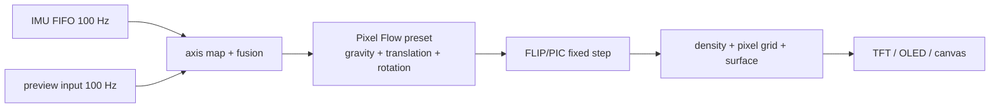

# Pixel Flow Plan Codex

แผนเพิ่มโหมดน้ำพิกเซลตามคลิปอ้างอิง

ปรับปรุง: 8 ตุลาคม 2026

ฐานโค้ด: `main` · commit `da4548a` · v0.1.3

สถานะ: แผนสำหรับลงมือพัฒนา ยังไม่ได้เพิ่มโหมดนี้ใน firmware หรือ preview

ชื่อที่เสนอ: **น้ำพิกเซล / Pixel Flow** · mode ID `pixel-flow` · NVS index `8`

## 1. เป้าหมายและสิ่งที่เห็นจากคลิป

อ้างอิง [I Made Pixel Water That Moves With My ESP32 — Code-September](https://www.youtube.com/shorts/LDzY95ezArg) ดูทั้งช่วงน้ำอยู่ด้านล่างและช่วงที่ผู้ถือหมุนเครื่องจนมวลน้ำขึ้นไปตามผนัง

ลักษณะที่ใช้เป็นเป้าหมาย:

- น้ำสีฟ้าอมเขียวบนพื้นหลังดำ ประกอบด้วยช่องพิกเซลสี่เหลี่ยมเล็ก ๆ มีช่องว่างสีเข้มระหว่างช่อง
- มวลน้ำดูเป็นก้อนต่อเนื่อง มีผิวสีอ่อนและขอบเป็นขั้นตามกริด ไม่ใช่เพียงจุดอนุภาคที่แยกห่างกัน
- เมื่อเอียง ผิวน้ำปรับไปตามทิศแรงโน้มถ่วง พร้อมคลื่นและการซัดที่ขอบ
- เมื่อหมุนเร็ว น้ำซัดขึ้นตามผนังและรวมตัวด้านข้างหรือด้านบนได้ ไม่ได้เปลี่ยนเป็นเส้นผิวน้ำเอียงทันที
- รูปร่างน้ำเปลี่ยนต่อเนื่องตามการขยับเครื่อง และมีการเคลื่อนต่อระหว่างเปลี่ยนทิศ

คลิปยืนยันรูปลักษณ์และพฤติกรรมที่มองเห็นได้ แต่ไม่ได้ให้ source code, สมการ, ค่าแรงหรืออัตราเฟรมจริง จึงไม่สรุปว่าเจ้าของคลิปใช้ FLIP, cellular automata หรือ solver ชนิดใด แผนนี้ใช้ FLIP/PIC ที่โครงการมีอยู่ แล้วปรับให้ได้พฤติกรรมใกล้เคียงจากการทดลอง

โหมดใหม่ต้องมีทั้งรูปลักษณ์และการตอบสนองต่อการขยับที่ต่างจากสามโหมดน้ำเดิม การเปลี่ยนสีหรือเปลี่ยนชื่ออย่างเดียวไม่ถือว่าทำเสร็จ

## 2. ขอบเขตของโหมดใหม่

เพิ่ม Pixel Flow เป็นโหมดที่เก้าใน binary เดิมทุกคู่บอร์ด/จอ ผู้ใช้เลือกจาก preview, หน้ามือถือ หรือปุ่ม BOOT ได้

| โหมด | แรงจากมุมเอียง | แรงจากการกระตุก | แรงจากการหมุน | ลักษณะภาพ |
| --- | --- | --- | --- | --- |
| `water` | มี | แอ็กชัน shake เดิม | ไม่มีแรงหมุนเพิ่ม | น้ำปกติเดิม |
| `water-inertia` | มี | จาก linear acceleration | ไม่มีแรงหมุนเพิ่ม | น้ำมีแรงเฉื่อยเดิม |
| `water-swirl` | มี | ไม่มีแรงกระตุกเพิ่ม | จาก gyro และ angular acceleration | น้ำวนเดิม |
| `pixel-flow` | มี | จาก linear acceleration | จาก gyro และ angular acceleration | น้ำพิกเซลสี cyan ผิวสว่าง การซัดและไต่ผนัง |

ทั้งสามโหมดเดิมมีโมเมนตัมของของไหลอยู่แล้ว จุดเพิ่มของ Pixel Flow คือรวมการขยับตัวภาชนะกับการหมุนเข้าด้วยกัน และปรับการแสดงภาพกับค่าการตอบสนองเฉพาะโหมด

รองรับบอร์ด ESP32 30-pin, C3 SuperMini และ C6 SuperMini กับจอทั้งหกโปรไฟล์ รวม 18 releases ใช้เซนเซอร์ BMI160/MPU6050 ชุดเดิม ไม่ต้องเพิ่มอุปกรณ์

งานรุ่นนี้ไม่รวมเมนู launcher, นาฬิกา, เคส หรือไอคอนของอุปกรณ์ในคลิป และไม่ขยายไปทำ Space/Level/Balance พร้อมกัน

## 3. ของที่มีอยู่และต้องใช้ต่อ

| ส่วนที่มีแล้วใน `main` | ใช้กับ Pixel Flow อย่างไร |
| --- | --- |
| `motion_sensor.h` | อ่าน FIFO 100 Hz; หน่วย accel เป็น m/s² และ gyro เป็น rad/s |
| `motion_state.h` / `web/motion.js` | axis map, quaternion fusion, gravity, linear acceleration, omega และ omegaDot |
| `toy_modes.h` / `web/water-modes.js` | แยกชนิดโหมดน้ำและกำหนดแรงที่แต่ละโหมดได้รับ |
| `flip_fluid.h` / `web/fluid.js` | FLIP/PIC, fixed step 25 ms, การชนผนัง, pressure projection และแรงในภาชนะที่หมุน |
| `rasterize()` / `pixelWater()` | เปลี่ยน density และอนุภาคเป็นกริดภาพ พร้อมจำแนกน้ำ/ผิว/นอกภาชนะ |
| `tilt_toy.ino` / `web/preview.js` | ส่งแรงเข้า solver แล้ววาดน้ำตามรูปทรงและขนาดจอ |
| build และ release tests | สร้าง merged firmware และตรวจ binary/manifest ทั้ง 18 ชุด |

เริ่มด้วย solver เดิมเพื่อให้ทดลองและเทียบได้เร็ว เปลี่ยน solver ทั้งชุดเฉพาะเมื่อมีผลทดลองว่าการรวมแรงและการปรับ renderer ยังทำพฤติกรรมหลักไม่ได้ และต้องอธิบายเหตุผลพร้อมผลวัดก่อนขยายงาน



## 4. การเพิ่ม ID โดยรักษาค่าที่บันทึกไว้

เพิ่ม `PixelFlow` ก่อน `ModeCount` ใน enum และต่อท้าย `modeIds`:

```cpp
enum ToyMode {
  Water = 0, Maze, Snow, Pong, Pet, Dice,
  WaterInertia, WaterSwirl, PixelFlow, ModeCount
};
// modeIds: water, maze, snow, pong, pet, dice,
//          water-inertia, water-swirl, pixel-flow
```

ผลที่ต้องได้: ID เดิม 0–7 ไม่เปลี่ยน, `PixelFlow == 8`, `ModeCount == 9` และ `isWaterMode(PixelFlow)` เป็นจริง

ลำดับปุ่ม BOOT แยกจากลำดับ NVS เพื่อรวมโหมดน้ำไว้ติดกัน:

```text
น้ำปกติ → น้ำมีแรงเฉื่อย → น้ำวน → Pixel Flow
→ เขาวงกต → หิมะ → Pong → ตา → ลูกเต๋า → น้ำปกติ
```

ใช้ `ModeCount-1` ในการตรวจค่าหรือ clamp แทนเลข 8 ที่กระจายหลายจุด เก็บ string ID `pixel-flow` ให้ตรงกันทุกหน้า ค่า mode ใน NVS ของเครื่องเก่าต้องยังเลือกโหมดเดิมหลังอัปเกรด

เมื่อพัฒนา Space/Level/Balance ต่อ ให้ต่อท้ายเป็น ID 9/10/11 รวมเป้าหมายอนาคต 12 โหมด ห้ามใช้ ID 8 ซ้ำกับ Pixel Flow

## 5. สมการการเคลื่อนไหว

### 5.1 ใช้ screen frame เดียวกัน

ยึดแกนของโครงการ: X ไปขวา, Y ลงล่าง, Z เข้าไปในจอ การหมุนตามเข็มนาฬิกาที่มองจากด้านหน้าจอมี omegaZ เป็นบวก ใช้ axis map และ display rotation กับทั้ง accel และ gyro ก่อนเข้าฟิสิกส์

รับค่าจาก motion layer เดิม:

```text
g         = เวกเตอร์แรงโน้มถ่วงที่โครงการใช้ หน่วยเวกเตอร์หนึ่งหน่วย
linear    = accel - 9.81 × g                 [m/s²]
omegaZ    = ความเร็วหมุนรอบแกนจอ              [rad/s]
alphaZ    = อัตราเปลี่ยน omegaZ               [rad/s²]
```

ใช้ `consumeFrame()` สำหรับค่าเฉลี่ย linear และ alpha ระหว่างเฟรม ห้ามนำผลของทุก sample ใน FIFO มาบวกซ้ำเป็นแรงของหนึ่งเฟรม เพราะความแรงจะเปลี่ยนตามจำนวน sample ที่สะสม

### 5.2 แรงเอียงและแรงขยับ

เริ่มจาก scale เดิม: แรงโน้มถ่วง 9.81 m/s² เท่ากับแรงใน solver 4 หน่วย ต่อความไว 1 เท่า

```text
s = sensitivity
k = 4 / 9.81

ax = 4 × s × gravityGain × g.x - k × s × linearGain × deadband(linear.x)
ay = 4 × s × gravityGain × g.y - k × s × linearGain × deadband(linear.y)
```

เครื่องหมายลบทำให้กระตุกเครื่องไปขวาแล้วน้ำซัดไปซ้าย เริ่มจาก deadband 0.4 m/s² ตามโหมดแรงเฉื่อยเดิม ปรับค่าเฉพาะ Pixel Flow หลังทดสอบ noise และการกระตุกเบา หากเปลี่ยนเป็น deadband แบบไล่ระดับ ต้องเขียนสมการและค่าคงที่ให้เหมือนกันใน JS/C++

กรณี sensor ยังไม่พร้อม ใช้ gravity `{0,1,0}` และแรงขยับ/หมุนเป็นศูนย์ พร้อมแสดงสถานะไม่พบ IMU ตามระบบเดิม

### 5.3 แรงในภาชนะที่หมุน

ใช้แรงหมุนที่มีใน solver อยู่แล้ว ไม่บวกแรงหมุนซ้ำใน `waterForces()`:

```text
rx = particle.x - container.cx
ry = particle.y - container.cy

rotationAx =  alphaZ × ry + 2 × omegaZ × vy + omegaZ² × rx
rotationAy = -alphaZ × rx - 2 × omegaZ × vx + omegaZ² × ry
```

สามส่วนคือแรงจากการเร่งหมุน (Euler), แรงจากความเร็วของน้ำในกรอบที่หมุน (Coriolis) และแรงออกจากศูนย์กลาง (centrifugal) ใช้ vx/vy เดิมของ particle ในการคำนวณทั้งสองแกน แล้วอัปเดตพร้อมกัน

แรงหมุนต้องส่งเข้า solver ทุก fixed step เมื่อมีการหมุน ไม่ใช่ตรวจ spin แล้วเรียก `impulse()` ครั้งเดียว ช่วงเริ่มหมุนและหยุดหมุนต้องมี alpha เครื่องหมายตรงข้ามกัน น้ำจึงเคลื่อนต่อและเปลี่ยนพฤติกรรมเมื่อหยุดภาชนะ

### 5.4 ค่าตั้งต้นและการจูน

ตัวเลขในตารางเป็นจุดเริ่มทดลอง ยังไม่ใช่ค่าที่รับรองว่าเหมือนคลิป:

| ค่า | เริ่มทดลอง | แนวทางปรับ |
| --- | ---: | --- |
| gravityGain | 1.0 | ใช้ฐานเดิมก่อน เพื่อเทียบกับน้ำปกติ |
| linearGain | 1.0 | ทดลอง 1.0–1.8 ถ้าการซัดจากการกระตุกเบาเกินไป |
| angularGain | 1.0 | ถ้าปรับ ต้องใช้ gain เดียวกันกับ omega และ alpha เพื่อรักษาความสัมพันธ์ |
| linear deadband | 0.4 m/s² | ปรับจากค่าขณะวางนิ่งและกระตุกเบาจริง |
| omega clamp | ±12 rad/s | เริ่มจากขีดจำกัด solver เดิม |
| alpha clamp | ±40 rad/s² | เริ่มจาก motion/solver เดิม |
| wallDrag | 0.10 | ทดลอง 0.05–0.15 ให้ไต่ผนังได้และกลับลงเมื่อหยุด |
| FLIP blend | 0.90 | ทดลอง 0.90–0.95 ถ้าคลื่นถูก damping มากเกินไป |
| fixed step | 25 ms | คงเดิมก่อน; ลด step เมื่อมีผลวัดความจำเป็นและงบ CPU |

ทำเป็น preset เฉพาะ `pixel-flow` ใน JS/C++ ไม่เปลี่ยน default ของสามโหมดเดิม ไม่เพิ่ม slider จูนเชิงเทคนิคในหน้าผู้ใช้รุ่นแรก

จูนครั้งละค่าและใช้ลำดับ input เดิม บันทึกผลว่าแรง/ระยะการซัด/เวลาสงบเปลี่ยนอย่างไร อย่าเพิ่มแรงทุกชนิดพร้อมกันเพื่อแก้ภาพที่ดูช้า

### 5.5 เสถียรภาพและการหยุดนิ่ง

รักษาการ clamp dt, accumulator, omega, alpha และความเร็ว particle ของ solver เดิม ความเร็วสูงสุดปัจจุบันคือ `0.65 × h / Step` ซึ่งจำกัดการเคลื่อนต่อ substep

เมื่อหยุดหมุน ห้ามเคลียร์ velocity ของอนุภาคทันที แต่ต้องไม่มีแรงหมุนค้างจาก input เก่า ถ้า noise ทำให้น้ำไม่นิ่ง ให้ตรวจ bias/linear/alpha ก่อนเพิ่ม damping และไม่ใช้ stationary state เพื่อลบการขยับเบาที่เกิดขึ้นจริง

การสลับโหมดต้อง reset fluid/preset ของโหมดใหม่และล้าง input จำลองที่ค้างอยู่ ส่วน quaternion บน hardware ให้คง tracking ต่อเนื่อง การ reset orientation ทำเฉพาะเหตุการณ์ที่ต้องเปลี่ยนแกน คาลิเบรต หรือกู้คืนข้อมูลเซนเซอร์

## 6. การวาดภาพให้ใกล้คลิป

### 6.1 แยกกริดจำลองกับกริดภาพ

กริด solver ควบคุมแรงดันและการชน ส่วนกริดภาพควบคุมขนาดพิกเซล จอ 240×240 ไม่จำเป็นต้องจำลอง 240×240 cells เพื่อให้ภาพละเอียด

เริ่มจากกริด solver เดิมและ rasterizer เดิมก่อน: สูงสุด 400 cells / 900 particles / raster 64×64 ค่าดังกล่าวเป็นงบคงที่ที่ต้องรักษาในการทดลองแรก

### 6.2 กริดภาพและ palette

- บนจอ 240×240 เริ่มจาก cell 7–8 pixels หรือประมาณ 30–34 ช่องตามด้านสั้น ให้ตรงกับลักษณะที่เห็นในคลิปโดยประมาณ
- ใช้ gap 1 pixel ระหว่างบล็อก ให้เห็นกริดโดยไม่แยกมวลน้ำจนดูเป็นจุดกระจัดกระจาย
- วาดบนพื้นดำหรือเกือบดำ ตัวน้ำ cyan และผิว cyan อ่อนเกือบขาว; กำหนด palette แบบ deterministic ใช้ชุดเดียวกันใน JS/C++ โดยยอมรับความละเอียด RGB565 ของจอ
- หากใช้สีตัวน้ำสองระดับ ให้ต่างกันเล็กน้อยและไม่สุ่มสีใหม่ทุกเฟรม เพราะจะกลายเป็นภาพกระพริบ
- ใช้ density/particle occupancy บอกช่องน้ำ ห้ามวาดสี่เหลี่ยมตาม particle แต่ละตัวจนบล็อกซ้อนกัน
- ช่องผิวน้ำต้องติดกับช่องว่างจริง ไม่ใช่ขีดเส้นตามสมการเอียงแยกต่างหาก ช่องที่ติดผนังเพียงอย่างเดียวไม่ใช่ผิวน้ำ

ใช้ผิวด้านตรงข้าม gravity จาก rasterizer เดิมเป็นฐาน แล้วตรวจช่วงน้ำไต่ผนัง/กลับหัว ถ้าขอบสว่างหายเพราะ effective acceleration เปลี่ยนทิศ ให้พิจารณาจำแนกขอบน้ำที่ติดอากาศทุกทิศเฉพาะ Pixel Flow พร้อม tests แทนการเปลี่ยน renderer เดิมทุกโหมด

### 6.3 รูปทรงภาชนะ

| จอ | รูปทรงและข้อกำหนด |
| --- | --- |
| ST7789 / GMT130 240×240 | เริ่มจากภาชนะสี่เหลี่ยมเดิม; มุมโค้งเป็นงานจูนหลังฟิสิกส์หลักผ่าน |
| GC9A01 240×240 | ใช้ภาชนะกลมและ mask เดิม ไม่มี pixels นอกวง |
| TFT 80×160 / 160×80 | ปรับขนาด cell ตามด้านสั้น พิกเซลยังเป็นสี่เหลี่ยม ไม่ยืดเป็นสี่เหลี่ยมผืนผ้า |
| OLED 128×64 | ใช้สีขาวบนดำและกริดเดิม; ไม่รับรองสีหรือชั้นผิวสีอ่อนแบบ TFT |

ถ้าทำมุมโค้งบนจอสี่เหลี่ยม ต้องให้ collision domain ตรงกับ mask ของภาพ การตัดภาพมุมออกอย่างเดียวจะทำให้น้ำหายไปในพื้นที่ที่ยังชนได้ ห้ามวาดกรอบ ชื่อโหมด หรือค่าตัวเลขลงบนพื้นที่เล่น

## 7. Preview ที่สาธิตการขยับจริงได้

โหมดใหม่ต้องลองได้โดยไม่ต้องมี hardware และใช้เส้นทาง force/solver เดียวกับ firmware

เพิ่มตัวควบคุมเฉพาะ Pixel Flow:

1. เอียง/หมุนในระนาบจอได้ถึง ±180° แทนข้อจำกัด ±60° ของ preview เดิม เฉพาะโหมดนี้
2. กระตุกสี่ทิศเพื่อสร้าง linear acceleration ชั่วคราว
3. หมุนรอบจอและหยุดหมุน เพื่อทดสอบ omega/alpha
4. ปุ่ม **หมุนเครื่องตัวอย่าง** และ **หยุดตัวอย่าง** ที่ใช้ลำดับ input กำหนดไว้แน่นอน

ข้อสำคัญ: `setTilt()` ปัจจุบัน reset quaternion เมื่อเลื่อน slider และ update จำลองมี gyro เฉพาะน้ำวน หากใช้ตรง ๆ โหมดใหม่จะเอียงได้แต่ไม่รับแรงจากการหมุน slider ต้องเพิ่มเส้นทาง input ของ Pixel Flow ที่เก็บ orientation ต่อเนื่องและคำนวณ gyro จากการเปลี่ยนมุม

แนวทาง implement:

- แยก target angle ที่ผู้ใช้เลือกกับ simulated orientation ที่ขยับจริง ไม่กระโดดไปมุมใหม่แล้ว reset fusion ทุกครั้ง
- คำนวณ sample ที่ 100 Hz: gravity ของ orientation จำลอง, linear ของ jolt และ gyro ที่สอดคล้องกับการเปลี่ยน orientation
- จัดการการข้าม +180°/−180° ด้วย angle unwrap หรือ quaternion เพื่อไม่ให้เกิดการหมุนกลับ 360° ปลอม
- เมื่อเปลี่ยน pitch ด้วย ต้องสร้าง gyro ให้สอดคล้องกับการหมุน 3 มิติ ไม่ถือว่า pitch เปลี่ยนจากแรงกระตุก
- ค่า gyro ต้องสอดคล้องกับการเปลี่ยน gravity; หลังวางนิ่ง linear ต้องกลับใกล้ศูนย์ ไม่สร้างแรงขยับปลอมจากมุมที่เปลี่ยน
- การเลื่อน slider เองระหว่าง demo ให้หยุด demo ก่อน แล้วทำต่อจาก orientation ล่าสุด ไม่เริ่มหมุนจากมุมศูนย์แบบกระโดด
- ปุ่มหยุดตัวอย่างหยุดการขยับภาชนะ แต่น้ำยังมี velocity อยู่ ปุ่ม reset ถ้ามีให้เป็นอีกแอ็กชันที่มีความหมายชัดเจน
- หลัง tab ถูกซ่อน ให้ pause demo และล้างเวลาสะสมส่วนเกินเมื่อกลับมา เพื่อไม่เร่งตามเวลาที่หายไป
- สลับโหมดแล้วล้าง demo/spin/jolt และคืนช่วง slider เดิม รวมถึงข้อความและค่า slider ให้ตรงกับภาพ

ลำดับ demo ที่เสนอ: วางตรง 1 วินาที → เอียงซ้าย/ขวาอย่างช้า → หมุนต่อเนื่องถึงด้านข้าง/กลับหัว → กระตุกสั้น → หยุดภาชนะและดูน้ำสงบ ใช้ลำดับเดียวกันในการเทียบ screenshot และวัดเชิงตัวเลข

ปุ่ม shake แบบสุ่ม impulse เดิมให้ซ่อนใน Pixel Flow เพื่อให้ demo และการกระตุกผ่านแรงที่วัด/จำลอง ไม่ซ้อนแรงพิเศษอีกชุด

## 8. หน้ามือถือและการบันทึกค่า

เพิ่ม `<option value="pixel-flow">น้ำพิกเซล · Pixel Flow</option>` ใน `devicePage`, ชื่อใน mapping ของ live status และการตรวจว่าโหมดใดเป็นน้ำ

แสดงระดับน้ำ, ความไว, Solver, จำนวนอนุภาค และแผง gravity/omega/linear เหมือนโหมดน้ำอื่น ซ่อนปุ่ม shake ในโหมดใหม่ และส่ง ID `pixel-flow` ผ่าน `/api/config`

API เดิมเพียงพอสำหรับรุ่นแรก ไม่จำเป็นต้องเพิ่ม endpoint เพื่อเปิดโหมดนี้ ถ้าต้องเพิ่มข้อมูลจูน/สถานะ ให้เพิ่ม field ใน `/api/status` อย่างมีชื่อชัดเจนและตรวจขนาด JSON buffer

บันทึก mode index 8 ใน NVS ผ่านเส้นทางเดิม ค่า fill/sensitivity/axis map ใช้ร่วมกันตามพฤติกรรมปัจจุบัน ไม่เพิ่ม profile ต่อโหมดจนกว่าจะมีเหตุผลจากการใช้งานจริง

## 9. ไฟล์ที่ต้องแก้และผลลัพธ์

| ไฟล์ | งานที่ต้องทำ |
| --- | --- |
| `firmware/tilt_toy/toy_modes.h` | เพิ่ม enum/ID, `isWaterMode`, BOOT order, preset และ branch รวมแรง |
| `web/water-modes.js` | mirror ID/แรง/preset ของ C++ |
| `firmware/tilt_toy/tilt_toy.ino` | เรียก preset, palette/renderer เฉพาะโหมด, devicePage และการแสดงสถานะ |
| `web/preview.js` | input หมุนต่อเนื่อง, demo, reset state และ renderer ของ Pixel Flow |
| `web/app.js` | เลือกโหมด, visibility ของ controls, slider bounds, start/stop demo และ readout |
| `web/profiles.js` | เพิ่ม mode definition ชื่อ/คำอธิบาย/glyph; เปลี่ยน VERSION เมื่อพร้อมออก release |
| `web/index.html` / `web/style.css` | controls และ layout มือถือสำหรับโหมดใหม่ |
| `flip_fluid.h` / `web/fluid.js` | แก้เมื่อ preset/การจำแนกผิว/ขอบชนจำเป็นต้องเพิ่ม API โดยรักษา default |
| `tests/water-modes.test.mjs` | แรงผสม, การคงค่าของโหมดเดิม, reset และ demo/preview behavior |
| `tests/motion-state.test.mjs` / `tests/motion/state_parity.cpp` | mode index/BOOT cycle, force parity และ input ที่จูนใหม่ |
| `tests/fluid.test.mjs` | ภาพกริด/ผิว/ขอบภาชนะ ถ้าปรับ rasterizer |
| `tests/device.test.mjs` | เลือก/บันทึก/live status/visibility ของโหมดใหม่ |
| `tests/releases.test.mjs` | ตรวจ ID `pixel-flow` ใน binary, version และ source hash |
| `scripts/build-firmware.mjs` | เปลี่ยนเฉพาะถ้าเพิ่ม source/header ใหม่ที่ต้อง stage/hash |
| `README.md`, `docs/HARDWARE.md`, `docs/VALIDATION.md` | วิธีเล่น โหมดที่เก้า ผลตรวจและข้อจำกัดจริง |

ไม่ต้องแก้ pin mapping, display driver หรือ firmware URL เพราะยังใช้ board/profile ชุดเดิม

## 10. ลำดับลงมือทำ

| ระยะ | งาน | ผลที่ต้องได้ก่อนทำต่อ |
| --- | --- | --- |
| P0: baseline | บันทึกพฤติกรรมและ numerical state ของสามโหมดเดิม ตรวจโค้ด `main` ล่าสุด | รู้ว่าอะไรต้องเหมือนเดิมและมีฐานเทียบ |
| P1: mode contract | เพิ่ม index 8, string ID, BOOT cycle, preview/phone selection | เลือกและบันทึกโหมดใหม่ได้ทุกทาง |
| P2: forces | รวม gravity + linear + rotation ด้วย preset เฉพาะ Pixel Flow | ทิศการซัด/หมุนถูกต้อง, JS/C++ force parity ผ่าน |
| P3: visual | palette cyan, กริด, ผิว และ mask/collision ที่ตรงกัน | น้ำเป็นมวลพิกเซลต่อเนื่องและไม่หายขอบ |
| P4: preview | เพิ่ม input ต่อเนื่อง, ±180°, demo และ stop | เห็นการไต่ผนังและการไหลต่อจาก controls จริง |
| P5: tuning | ใช้ input sequence เดิมจูนแรง/drag/blend ทีละค่า | มีค่าที่บันทึกได้และหลักฐานความต่างจากสามโหมดเดิม |
| P6: validation | host tests, browser QA, benchmark และบอร์ดจริงถ้ามี | ผ่าน checklist พร้อมระบุข้อที่ยังไม่ได้ทดลอง |
| P7: release | version, build 18 ชุด, checksum/source hash, web build และ docs | artifacts ตรงกับ source สุดท้าย |

เริ่มจากจอสี่เหลี่ยม 240×240 เพื่อเทียบคลิป แล้วตรวจจอกลม จอแนวตั้ง/แนวนอน และ OLED การทดสอบ host/browser ทำได้ทันที ส่วนผล FPS และพฤติกรรม sensor จริงต้องวัดกับอุปกรณ์

## 11. เกณฑ์ทดสอบเชิงตัวเลข

### 11.1 ความเข้ากันได้

- ID/NVS 0–7 ยังตรงกับโหมดเดิม; index 8 เข้า Pixel Flow
- BOOT cycle ผ่านครบเก้าโหมดและกลับไป Water ไม่มีโหมดตกหล่น
- น้ำปกติยังไม่รับ linear/rotation เพิ่ม น้ำแรงเฉื่อยยังไม่รับ rotation น้ำวนยังไม่รับ linear
- default force, fluid state และ palette ของสามโหมดเดิมไม่เปลี่ยนจาก baseline

### 11.2 แรงและการเคลื่อนไหว

- ตั้ง gravity ลงล่างแล้วใส่ linearX เป็นบวก: ค่าแรง X เพิ่มในทิศลบ
- ใส่ linear โดย gyro เป็นศูนย์: ไม่สร้าง omega ปลอม
- ใส่ omega/alpha โดย linear เป็นศูนย์: มีแรงหมุนและไม่มีแรงขยับปลอม
- ใส่ translation กับ rotation พร้อมกัน: ทั้งสองส่วนมีผลโดยไม่ใช้ impulse ซ้ำ
- เมื่อน้ำอยู่ราบ เริ่มหมุนตามเข็มด้วย alpha บวก: momentum สัมพัทธ์ของน้ำเริ่มสวนการเร่งภาชนะ หยุดด้วย alpha ลบแล้วน้ำยังเคลื่อน
- input ขณะนิ่งหลัง filter มี linear ใกล้ศูนย์และ omega ลดลง ไม่ทำให้เกิดน้ำวนถาวร
- gravity ที่กลับหัวทำให้น้ำไหลไปด้านบนของ screen frame โดยอนุภาคยังอยู่ในภาชนะ

### 11.3 ขอบเขตและการเปรียบเทียบ JS/C++

ทดสอบทั้งภาชนะกลม/สี่เหลี่ยมและ fill 10/50/90% ด้วย input ปกติและ input สลับรุนแรงอย่างน้อย 1,000 steps ค่าตำแหน่ง/ความเร็วต้อง finite, particle count คงที่ และไม่หลุด collision domain

ตรวจแรง Pixel Flow และ fusion parity เพิ่มใน harness เดิม สำหรับ solver ให้แยก single-step numerical parity กับ long-run invariants อย่างชัดเจน โค้ดปัจจุบันมี float/double ทำให้การชนและการเลือก cell แยกจากกันได้เมื่อสะสมหลาย steps จึงไม่ใช้คำว่า trajectory ตรงกันเพียงเพราะ single-step ผ่าน

ถ้าจะกำหนด tolerance ของ long trajectory ให้เก็บ golden input และรายงานผลวัดก่อนกำหนดค่า ใช้ตัวชี้วัดระดับมวลน้ำ เช่นจุดศูนย์กลางมวล/ขอบเขต/ความเร็วรวม แทนการเพิ่ม tolerance ราย particle จน test ไม่มีความหมาย

## 12. Browser QA และการเทียบคลิป

ใช้ in-app browser กับ build ที่ใช้งานจริง ไม่ยืนยัน UI เพียงจาก source code:

- เลือกน้ำพิกเซลแล้วเห็นคำอธิบายและ controls เฉพาะโหมด
- เอียงช้า ±30°/90°/กลับหัว: น้ำย้ายไปด้านล่างตามโลก มีเวลาตอบสนองและคลื่นที่ขอบ
- หมุนเร็วและหยุด: น้ำขึ้นตามผนังแล้วค่อยกลับลง โดยไม่ได้ reset ก้อนน้ำตอนหยุด
- กระตุกซ้าย/ขวา/ขึ้น/ลง: ทิศการซัดสอดคล้องกับชื่อปุ่ม
- demo start/stop, slider ระหว่าง demo, reload และ mode switch: state/readout/controls ไม่ค้าง
- เลือกครบหกโปรไฟล์จอ: น้ำถูก clip ตามภาชนะ cell ไม่ยืดและไม่ล้น canvas
- viewport 390×844: ไม่มี page horizontal overflow และปุ่มสำคัญใช้งานได้
- โหมดเดิมกลับมาใช้ controls และช่วง slider เดิมได้ถูกต้อง

บันทึกภาพอย่างน้อยสี่สถานะ: วางตรง, เอียง, น้ำไต่ผนัง และหลังหยุด พร้อม preset/input ที่ใช้ เทียบความต่อเนื่องของมวลน้ำ กริด ผิว และการซัดกับคลิป ไม่กล่าวว่าเหมือน 1:1 เพราะไม่มีข้อมูลการเคลื่อนไหวและ source ของต้นแบบ

## 13. งบประสิทธิภาพและการทดสอบ hardware

การเพิ่มหนึ่งโหมดไม่ควรเพิ่ม solver instance อีกชุด ใช้ storage เดิมและ reset เมื่อเลือกโหมด เริ่มด้วยงบ 400 cells / 900 particles และหลีกเลี่ยง heap allocation ใน sample/substep/render loop

เป้าหมาย solver ไม่เกินประมาณ 20–25 ms ต่อเฟรมบน C3/C6 ตามแนวทางโครงการ ต้องวัด `simMs`, FPS, free heap และ FIFO resets จริง ทั้งเมื่อ Wi-Fi ปิดและเปิด ค่า Global RAM จาก linker ไม่รวม framebuffer/heap จึงใช้แทนผลวัดไม่ได้

ทดสอบ hardware ตามลำดับ:

1. บอร์ดที่มีพร้อมจอสี่เหลี่ยม 240×240 ตรวจแกนและ gyro bias ด้วยแผงมือถือก่อนเล่น
2. วางนิ่ง → เอียงช้า → กระตุก → หมุนเร็ว → หยุด → กลับหัว บันทึกผลแต่ละท่า
3. ทดสอบทั้ง BMI160 และ MPU6050 ก่อนอ้างว่าพฤติกรรมทั้งสองชิปผ่าน
4. ใช้จอ OLED ร่วม I²C และจอ SPI ขนาดใหญ่ตรวจว่าการส่งภาพไม่ทำให้ FIFO overflow ระหว่างการเล่นปกติ
5. ทดสอบ NVS หลัง reboot และการอัปเกรดจากเครื่องที่เก็บ mode 0–7
6. ถ้า CPU ไม่พอ ให้ลดงานวาด/กริดตามจอก่อนเพิ่ม task หรือเปลี่ยนสถาปัตยกรรม I²C

ถ้าไม่มีอุปกรณ์จริง ให้ส่งมอบผลซอฟต์แวร์พร้อม `hardwareTested: false` และระบุท่าทดสอบที่เหลือ ไม่เติมผล FPS หรือความเหมือนคลิปจากการคาดเดา

## 14. Build และ release

เสนอ release v0.1.4 เมื่อ implementation พร้อม โดยเปลี่ยน version ให้ตรงกันใน `package.json`, `package-lock.json`, `web/profiles.js`, `web/index.html` และ `firmware/tilt_toy/config.h` เอกสารแผนนี้ยังไม่เปลี่ยน version ของโค้ด

เส้นทาง build:

```sh
node --test tests/motion.test.mjs tests/motion-state.test.mjs tests/water-modes.test.mjs tests/fluid.test.mjs tests/device.test.mjs
npm run firmware
npm test
npm run build
```

รอบ test ก่อน build ใช้ตรวจ host logic ที่กำลังทำ ส่วน full suite ที่มี release tests รันหลังสร้าง binary ใหม่ ด้วย host C++ compiler ที่พร้อม (`g++`, `clang++` หรือ MSVC โดยตั้ง `CXX=cl` ใน Developer Command Prompt) ไม่ถือว่าผ่านครบเมื่อมี tests ที่ถูกข้าม

`npm run firmware` สร้างครบ 18 คู่บอร์ด/จอ ทุก binary ต้องมี `pixel-flow` และ metadata/checksum/source hash ตรงกัน ปัจจุบัน hash รวม source หกไฟล์ หากเพิ่ม header ใหม่ต้องเพิ่มทั้ง staging และรายการ hash ใน build script กับ release test

ตรวจว่า binary/manifest ใน `dist/` ตรงกับ `web/firmware/` และหน้า installer ยืนยันไฟล์รุ่นใหม่ได้ก่อนสรุปว่าส่งมอบแล้ว การ push หรือเผยแพร่เว็บเป็นขั้นแยกตามคำขอของผู้ใช้

## 15. สิ่งที่ต้องส่งมอบและเงื่อนไขจบงาน

- [ ] Pixel Flow เป็นโหมดที่เก้า เลือกได้จาก BOOT, preview และหน้ามือถือ
- [ ] แรงเอียง/กระตุก/หมุนทำงานร่วมกัน ทิศถูกต้อง และไม่มี generic impulse ซ้อน
- [ ] ภาพน้ำ cyan เป็นกริดแน่น มีผิวสว่างและไม่หายตามขอบภาชนะ
- [ ] เอียง/หมุนเร็วแล้วน้ำซัดไต่ผนัง หยุดภาชนะแล้วน้ำยังเคลื่อนก่อนสงบ
- [ ] demo/input ของ preview ต่อเนื่อง ไม่สร้างแรงปลอมจาก quaternion reset
- [ ] สามโหมดน้ำเดิมและ NVS index เดิมคงพฤติกรรมเดิม
- [ ] tests เชิงแรง/ขอบเขต/parity/UI ผ่านพร้อม host compiler ไม่มี skip ที่ปิดบังผล
- [ ] firmware/manifest ทั้ง 18 ชุดและ web build ตรงกับ source สุดท้าย
- [ ] มีภาพผลเทียบคลิปและบันทึก preset/input ที่ใช้
- [ ] บันทึกผล hardware ที่ได้ทดลองจริง หรือระบุรายการที่ยังไม่ได้ทดลอง
- [ ] README/HARDWARE/VALIDATION อธิบายวิธีเล่นและผลตรวจของรุ่นที่ส่งมอบ

โหมดถือว่าพร้อมด้านซอฟต์แวร์เมื่อเลือกได้จริง มีความต่างด้านแรงและภาพตามเกณฑ์ และผ่านชุดตรวจ artifacts ส่วนความใกล้เคียงการถือ/หมุนในคลิปและงบ FPS บนเครื่องต้องสรุปจากการทดลอง hardware แยกต่างหาก
